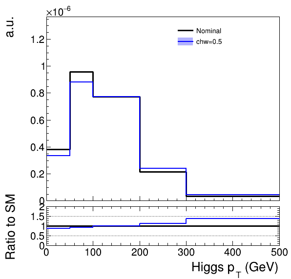

# Hands-on EFT exercise

The goals of this exercise are to gain experience with event simulation, the parameterisation of effective field theory (EFT) deviations on SM cross sections, and some of the aspects of setting EFT constraints in data analysis.

## Software environment

This exercise can either be completed on the CERN `lxplus` service, or by setting up a similar environment using `Docker`.

### Docker

You only need to follow this part if using Docker on your own laptop, and you need to install it for the first time. If not, proceed to the next section below.

Download and install the Docker desktop app for your platform from https://www.docker.com.

Once installed, you should have the `docker` command available from the command line.

> Note, if using a new Mac with Apple Silicon, you may get better performance from enabling:
https://levelup.gitconnected.com/docker-on-apple-silicon-mac-how-to-run-x86-containers-with-rosetta-2-4a679913a0d5

To download and run the docker image:

```sh
docker run --cap-add SYS_ADMIN --device /dev/fuse -it gitlab-registry.cern.ch/agilbert/eft-exercise-docker:snapshot /bin/bash
```

The software needed for the exercise is already installed in the image, within the `EFT-HandsOn` directory. To make sure you have the latest version of the software:

```sh
cd EFT-HandsOn
git pull
```

To finish setting up the software environment:

```sh
source setup.sh
```

Instructions for setting up the software on lxplus are given below.

### lxplus

First clone this repository somewhere:

```sh
git clone https://github.com/ajgilbert/EFT-HandsOn.git
cd EFT-HandsOn
```

Inside the `EFT-HandsOn` directory we will install the software needed for this exercise. The main tool we will use is **EFT2Obs**, which will itself install the **Madgraph5_aMC@NLO** Monte Carlo event generator, and the **RIVET** framework for defining analysis selections and observables.

To download **EFT2Obs** and complete the installation, run

```sh
./setup.sh
```

Note that to make sure everyone has a consistent software environment, this script will also checkout a CMSSW release (CMSSW_11_3_4).
Once the installation is complete, we will source the `setup.sh` script to set all the environment variables correctly. Note that you will need to run this in every new session:

```sh
source setup.sh
```

## Install the SMEFTsim models

First we will work with the EFT2Obs package. A script is provided to download and install the SMEFTsim UFO models. These will be installed in the `MG5_aMC_v2_6_7/models` directory:

```sh
cd EFT-HandsOn/EFT2Obs
./scripts/setup_model_SMEFTsim3.sh
```

If we now look inside the Madgraph `models` directory, we'll see the different variants of the SMEFTsim model:

```sh
ls -1 MG5_aMC_v2_6_7/models/
SMEFTsim_MFV_MwScheme_UFO
SMEFTsim_MFV_alphaScheme_UFO
SMEFTsim_U35_MwScheme_UFO
SMEFTsim_U35_alphaScheme_UFO
SMEFTsim_general_MwScheme_UFO
SMEFTsim_general_alphaScheme_UFO
SMEFTsim_topU3l_MwScheme_UFO
SMEFTsim_topU3l_alphaScheme_UFO
SMEFTsim_top_MwScheme_UFO
SMEFTsim_top_alphaScheme_UFO
[...]
```

Let's look inside one of the models:

```
cd MG5_aMC_v2_6_7/models/SMEFTsim_topU3l_MwScheme_UFO/
ls
```
You should see a few files that start `restrict_[...].dat`. These predefine values for all the parameters of the model, and can be used when importing the model to generate a process. Of relevance for us are the values of the SMEFT parameters:

```
Block SMEFT 
    1 0.200000e+00  # cG 
    2 0.300000e+00  # cW 
    3 0.400000e+00  # cH 
    4 0.500000e+00  # cHbox 
    5 0.600000e+00  # cHDD 
    6 0.700000e+00  # cHG 
    7 0.800000e+00  # cHW 
    [...]
```

Madgraph has some special (and slightly non-intuitive) behavior regarding the values of these parameters. The important point for us is that if we set any to zero in the restrict file, their contributions will never be in the amplitudes that are generated.

So if we wanted to include all possible SMEFT effects we could use the `restrict_massless.dat` that's already included. In this exercise we will consider a more limited set of operators - just the bosonic `cHbox`, `cHDD`, `cHW`, `cHB` and `cHWB`. This is just for speed in this exercise, normally we would want to include all possible effects.

A restrict file that limits us to these operators is in the EFT-HandsOn directory, so we can copy it into the model directory:

```sh
cp ../../../../restrict_massless_HVV.dat ./
```

## Generate a process

Now we're ready to generate a process, so we start by setting up all the necessary Madgraph cards. First create `cards/Higgs-VBF/proc_card.dat`:

```
import model SMEFTsim_topU3l_MwScheme_UFO-massless_HVV

define e = e+ e-
define mu = mu+ mu-

generate p p > h j j $$ w+ w- z a QCD=0 NP<=1, h > e mu vl vl~ NP=0

output Higgs-VBF
```

In the first line we import the model, the syntax is `[MODEL]-[RESTRICT FILE]`, where the restrict file is given without the `.dat` extension.

We are going to generate Higgs boson production via vector boson fusion, and then decay it via the WW channel to the e+mu+2nu final state. So for the first part we generate `p p > h j j`, i.e. Higgs plus two jets. If you try and generate this alone (see below), you will see we get diagrams that do not look like VBF, but where the two jets emerge from a virtual vector boson. One could argue that all such diagrams should be included anyway, as they all contribute to the same final state. In this case we will focus on the "pure" VBF process, and use the `$$ w+ w- z a` syntax to remove diagrams that have a vector boson in an s-channel configuration. We also want to exclude diagrams where the jets come not from VBF, but from initial state QCD radiation (i.e. gluon fusion + 2 jet), and so we set the order of QCD couplings to zero: `QCD=0`.

Then we set `NP<=1` - allowing up to one insertion of the EFT vertices. We separate the production and decay parts with a comma (forcing the inclusion of an on shell Higgs boson), with the decay part given as `h > e mu vl vl~`, where we use convenient definitions of `e` and `mu` to cover both charges, and `vl` to cover all possible neutrinos. Madgraph will find the actual combinations of particles that respect all conservation laws.

In the last part we give Madgraph the directory to output the process to: `output Higgs-VBF`.

> In the next section we are going to largely follow the standard EFT2Obs workflow presented in the slides. You may find it useful to cross reference with the EFT2Obs README: https://github.com/ajgilbert/EFT2Obs/tree/master#readme, which gives more details on all the scripts and their options.

We can run this card with Madgraph to generate the process:

```sh
./scripts/setup_process.sh Higgs-VBF
```
All the generated code to evaluate the matrix element for this process will be in `MG5_aMC_v2_6_7/Higgs-VBF`. Inside the directory you can find plots of all the generated diagrams: `MG5_aMC_v2_6_7/Higgs-VBF/SubProcesses/P1_qq_hqq_h_llvlvl/*.jpg`.

## Set up the other cards

You should find that the `run_card.dat` and `pythia8_card.dat` generated by Madgraph have been copied into the `cards/Higgs-VBF` directory. Most of the default settings are fine, but we need to change a few things:

 - In `run_card.dat`, change `True  = auto_ptj_mjj` to `False  = auto_ptj_mjj`
 - Also change the `ptj` cut from 20.0 to 25.0, and set `ptl` to 0. (i.e. no lepton pT cut). Also set `drll` to 0.
 - Change `True  = use_syst` to `False  = use_syst`, and `systematics = systematics_program` to `none = systematics_program` - these are extra reweighting features that cause conflicts with the EFT reweighting
 - In the `pythia8_card.dat`, uncomment the last line, i.e, `!partonlevel:mpi = off` to `partonlevel:mpi = off`. This turns off the simulation of multi-parton interactions, making the event generation much faster.

Next we need to create the EFT2Obs config JSON, and the `param_card.dat` and `reweight_card.dat`. We could do this step-by-step, following the EFT2Obs instructions, but a quicker way is to use the `auto_detect_operators.py` script, which determines the list of operators affecting the generated process, and automatically creates the config file and `reweight_card.dat` using reasonable default settings:

```sh
python scripts/auto_detect_operators.py -p Higgs-VBF

>> Loading model: SMEFTsim_topU3l_MwScheme_UFO
>> Possible parameters: ['cHbox', 'cHDD', 'cHW', 'cHB', 'cHWB']
>> Method 1 relevant parameters: ['cHB', 'cHDD', 'cHW', 'cHWB', 'cHbox']
>> Method 2 relevant parameters: ['cHB', 'cHDD', 'cHW', 'cHWB', 'cHbox']
>> Relevant parameters from propagator corrections: []
>> Final relevant parameters: ['cHB', 'cHDD', 'cHW', 'cHWB', 'cHbox']
>> Making config json
python scripts/make_config.py -p Higgs-VBF -o cards/Higgs-VBF/config.json --pars SMEFT:4,5,7,8,9  --def-val 0.01 --def-sm 0.0 --def-gen 0.0
>> Parsing MG5_aMC_v2_6_7/Higgs-VBF/Cards/param_card.dat to get the list of model parameters
>> Selecting 5/5 parameters in block SMEFT:
    - [4] chbox
    - [5] chdd
    - [7] chw
    - [8] chb
    - [9] chwb
>> Writing config file cards/Higgs-VBF/config.json
>> Making reweight card
>> Created cards/Higgs-VBF/reweight_card.dat with 21 reweighting points
```
Have a look at these files and make sure you understand the contents. The last part is to create the `param_card.dat`:

```sh
python scripts/make_param_card.py -p Higgs-VBF -c cards/Higgs-VBF/config.json -o cards/Higgs-VBF/param_card.dat
```

Now we can make the gridpack:
```sh
./scripts/make_gridpack.sh Higgs-VBF
```
From this we could generate some events, but unfortunately we don't have anything we can do with them. This is where the RIVET part comes in.

## RIVET

[RIVET](https://rivet.hepforge.org) is a C++ framework for defining generator-level event selections and observables. We define a class deriving from `Rivet::Analysis`, which we compile to produce a kind of plug-in module that we can use when running the RIVET program on our PYTHIA-showered events. The RIVET installation already contains a [large catalogue](https://rivet.hepforge.org/analyses.html) of analyses. In EFT2Obs we store additional ones in the `RivetPlugins` directory. The code there is compiled by running `./scripts/setup_rivet_plugins.sh`.

A basic RIVET analysis is included in this repository: `HiggsVBF.cc`. Copy this into `EFT2Obs/RivetPlugins`, and run the script above to compile it. Have a look through the code. It applies a basic selection requiring two charged leptons and two jets. A histogram of the Higgs candidate pT is filled. Note how histograms are first added as data members of the class, and that in the `init()` function we have to call the `book(histogram, label, nbins, min, max)` to define the actual properties. The histogram is then filled in the `analyze` function, and the normalization adjusted via the `scale` function in `finalize()`, which runs after all events have been processed. 

This code hides one of the powerful features of RIVET: under the hood, an instance of the histogram is automatically created and filled for every event weight RIVET encounters in the input. This is exactly what we need - we can extract the EFT scaling from the set of histograms created for each reweighting point.

To produce events from the gridpack and run our RIVET analysis, we use:

```sh
python scripts/run_gridpack.py --gridpack gridpack_Higgs-VBF.tar.gz -s 1 -e 5000 -p HiggsVBF -o test-Higgs-VBF
```

where
 - `-s` is the random number generator seed to use
 - `-e` gives the number of events to generate
 - `-p` is a comma-separated list of of RIVET analyses to run
 - `-o` gives the name of the output directory (will be created if needed)

 When the script finishes, the output histograms will be in the `test-Higgs-VBF/Rivet_1.yoda` file. The are written in a human-readable format called [YODA](https://yoda.hepforge.org). Note that the intermediate LHE and HepMC files are not saved (the latter can be quite large), but `run_gridpack.py` has options to save/load these if needed.

 ### Parallel running

 If you need to increase the number of events in the output then we can use the `launch_jobs.py` helper script to call `run_gridpack.py` in parallel:

```sh
 python scripts/launch_jobs.py --gridpack gridpack_Higgs-VBF.tar.gz -j 4 -s 1 -e 20000 -p HiggsVBF -o test-Higgs-VBF --job-mode interactive --parallel 4
 ```
 Here we run four jobs (`-j 4`) - the random number seeds will start consecutively from 1. The four output files can be merged into one yoda file with: `yodamerge Rivet_* -o Rivet.yoda`. 

 ## Extracting the scaling functions and plotting

A script `get_scaling.py` is used to extract the EFT scaling from the yoda file:

```sh
python scripts/get_scaling.py -c cards/Higgs-VBF/config.json -i test-Higgs-VBF/Rivet.yoda --hist "/HiggsVBF/HiggsPt"
```

We have to give it the config file so it can infer which operators and Wilson coefficient values each reweight point corresponds to. The histogram name is a string in the form `/[Analysis name]/[Histogram name]`. The coefficients for each bin are printed to the screen:

```
-----------------------------------------------------------------
Bin 0    numEntries: 2713       mean: 7.02e-09   stderr: 4.17e-13  
         edges: [0.0, 50.0]
-----------------------------------------------------------------
Term                 |          Val |       Uncert | Rel. uncert.
-----------------------------------------------------------------
1                    |       1.0000 |       0.0001 |       0.0001
chbox                |       0.1209 |       0.0000 |       0.0002
chbox * chbox        |       0.0034 |       0.0000 |       0.0060
chdd                 |      -0.0112 |       0.0012 |       0.1120
chdd * chdd          |       0.0007 |       0.0001 |       0.0777
[...]
```

The uncertainties shown are statistical. A json file `HiggsVBF_HiggsPt.json` is also produced, which contains all the same information in a convenient form for processing with other scripts. You may find the statistical uncertainties in the final bins are quite large, due to the limited number of events. The input histogram can be rebinned on the fly by adding, e.g., `--rebin 0,50,100,200,300,500`. 

With this json file, we can make a plot of the distribution, superimposing the expectation with any values of the coefficients:

```sh
python scripts/makePlot.py --hist HiggsVBF_HiggsPt.json -c cards/Higgs-VBF/config.json --x-title "Higgs p_{T} (GeV)" --draw chw=1:4 --ratio=0,2 --show-unc
```

The `--draw` options supports multiple arguments of the form: `[param1]=[val1],[param2]=[val2],..[paramN]=[valN]:[ROOT color code]`.




**Tasks:**

 - The options `--no-square --no-cross` can be added to the plotting script to ignore the ci^2 or ci*cj terms respectively. In this way the interference-only effects can be isolated. Add the other operators to this plot (some tuning of the coefficient values will be needed), and see how much of a difference there is when the quadratic terms are suppressed.
 - Add some additional observables to the RIVET analysis. See if you can find some distributions that could have different/stronger constraining power on the operators in question. Angles involving the two jets may be of interest.
 - [Optional] regenerate the process including all possible operators this time.

## EFT fits


```sh

for POI in chb chbox chdd chw chwb; do python ./plot1DScan.py -m scan_test_${POI}.root --POI ${POI} --translate translate_root_SMEFTsim3.json --output nll_scan_${P
OI} --model eft --json eft_scans.json --no-input-label --chop 100 --y-max 30 --remove-near-min 0.8; done
```